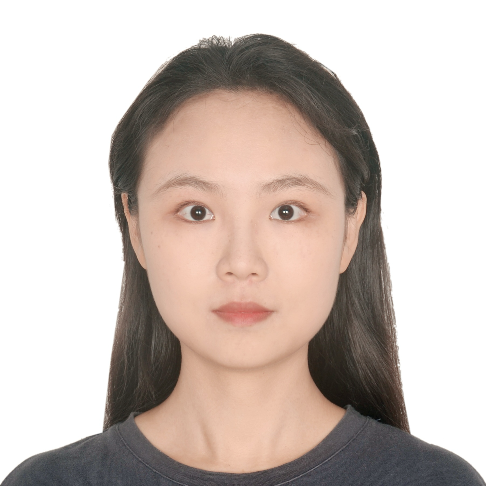
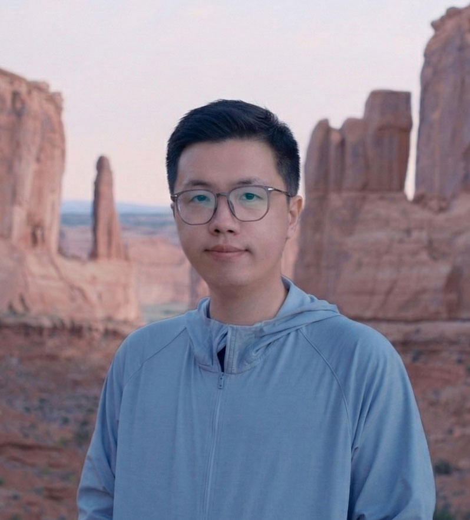

**Students at Oregon State University** 
 
**Ph.D. Students** 
 

  <!-- Left column: photo + name/title -->
  

    
    <h3 style="margin:5px 0 0 0;">
      <a href="https://www.linkedin.com/in/wenjia-xia-9bbbba350/" target="_blank">Wenjia Xia</a>
    </h3>
  

  <!-- Right column: description text -->
  

    

      Wenjia has joined us as a PhD student in Sep 2024. Her research focuses on enhancing grid-edge flexibility by developing multimodal data-fusion-based load forecasting models that capture the dynamic behavior of end-use consumption. These methods aim to improve power system resilience by enabling more accurate characterization of demand-side flexibility and response potential. Before joining OSU, she received her Master’s degree from Dalian Maritime University, where her research focused on distributed optimization and control. In her free time, she enjoys hiking, exploring local restaurant spots, and spending time with her cat.
    

  

 

  <!-- Left column: photo + name/title -->
  

    
    <h3 style="margin:5px 0 0 0;">
      <a href="https://lingdong.me" target="_blank">Lindong Zhou</a>
    </h3>
  

  <!-- Right column: description text -->
  

    

      Lingdong has joined us as a PhD student in Sep 2025. He holds a Bachelor's degree from Xidian University and a Master's degree from the University of California, Riverside. With multiple years of professional experience in the field of sustainability, his research interests primarily lie in Artificial Intelligence for Energy, with a current focus on Demand Response. He explores topics such as Load Disaggregation, Risk-aware Bidding, and User Behavior Modeling to develop data-driven decision-making tools for smart grids, thereby facilitating more efficient power market. When he is free, he enjoys soccer, tennis, music, and video games.
    

  

 

  <!-- Left column: photo + name/title -->
  

    
    <h3 style="margin:5px 0 0 0;">
      <a href=" https://www.linkedin.com/in/shrinidhi-n-50865b1a7/" target="_blank">Shrinidhi Nadgouda</a>
    </h3>
  

  <!-- Right column: description text -->
  

    

      Shrinidhi has joined us as a PhD student in Sep 2025. She graduated with a double major in Electrical Engineering and Physics from the University of Virginia in 2025. Her research interests include power distribution system management and control. She has been working on risk-aware reinforcement learning for grid anomaly mitigation.  In her free time, Shrinidhi enjoys playing rugby on Oregon State Womens+ Rugby, doing Indian classical dance, listening to music, and exploring new restaurants and coffeeshops.
    

  

 

  <!-- Left column: photo + name/title -->
  

    
    <h3 style="margin:5px 0 0 0;">Penghan Yang</h3>
  

  <!-- Right column: description text -->
  

    

      Penghan has joined us as a PhD student in Sep 2025. He received his bachelor degree from Shandong University and his master degree from Zhejiang University of Science and Technology in China. Penghan is interested in utilizing various artificial intelligence methods for energy-related projects. Currently, he is focusing on developing artificial intelligence agents for energy system operation and applying computer vision techniques to asset monitoring. In his free time, He is enthusiastic about strength training, experimenting with different coffees and brewing methods, and exploring trails in the Pacific Northwest. He is also a loyal supporter of FC Barcelona.
    

  

 
 

**Undergraduate Students** 
 
 
Ruiqi Li 
 
Ruiqi was previously an undergraduate student at Oregon State University and is now pursuing her undergraduate studies at Texas A&M University. She is working with us on energy affordability. 
 
 

**Students at National Renewable Energy Laboratory**
 
 
1. Keyang Xuan
 
 
Keyang is a graduate intern at National Renewable Energy Laboratory. He is currently a MSc student student in University of Illinois, Urbana-Champaign (UIUC). Keyang is working with us on grid edge resource flexibility prediction with social impact integrated. 
 
 

**Alumni**
1. Roshan Klein-Seetharaman
 
Roshan was an undergraduate intern at National Renewable Energy Laboratory and was continously working with us after the internship.  He is currently an undergraduate student in Yale University. Roshan worked with us on utilizing transfer learning to enhance grid edge load forecasting. 
 
 
2. Daniel Lee
 
Daniel is an undergraduate student at Oregon State University. Daniel worked with us on EV adoption estimation. 
 
 
3. Levi Lao
 
Levi is an undergraduate student at Oregon State University. Levi worked with us on EV grid impact analysis. 
 
 
4. Guowei Li
 
Guowei is an undergraduate student at Oregon State University. Guowei worked with us on power distribution system simulations. 
 
 

**Openings:**

We are seeking two highly motivated PhD students to join our group in Fall 2026. The ideal candidates will have strong interests in applying deep learning techniques to challenges in power and energy systems. If you are interested, please email me your CV and transcript, and apply <a href="https://gradschool.oregonstate.edu/admissions">here</a>. We welcome master students and undergradudate students who have passion for clean energy research. If you have interest, please send me an email.
